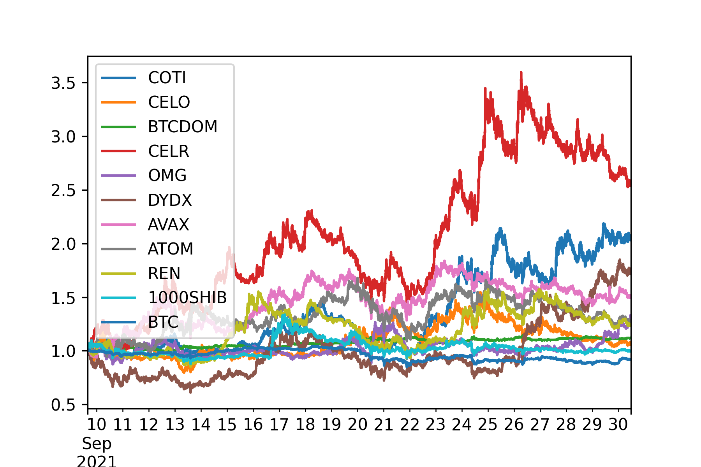

# Are altcoins are just leveraged version of Bitcoin? 
[medium link](https://medium.com/@jsrimr2/including-these-hidden-coins-into-your-portfolio-will-earn-you-high-profits-cb705a5d9a62) 

[Jupyter notebook](./Final_submission.ipynb)

Analysis on Binance-Futures-Data



## Questions & Answers in this repo
1. Are altcoins are just a leveraged version of Bitcoin?
: No, 7% of Alt-coins don't have linear relationship with Bitcoin
2. Is the relationship found in question1 applies same regardless of the market situation?
: Weakly yes. The coins showed decoupling behavior in general also showed decoupling behavior when Bitcoin price is going down.
3. Is the relationship found in question1 applies consistently regardless of the time?
: Weakly yes. BTCDOM decoupled for all time periods in the data, but other coins did not.

## Requirements
```bash
pip install -r requirements.txt
```


## Usage

1. Data

Binance_future_1m_data : https://drive.google.com/file/d/1F1rRyqLXNVp2YE4TS02NP3NbAdDfY6k3/view?usp=sharing
Binance_spot_1m_data : https://drive.google.com/file/d/1BeHTyPY32iHDjy3xVRwxlxIMlh6vYuoz/view?usp=sharing


Or you can download data using this code:
    download data : (codes are heavily from [Tistory](https://github.com/Yeachan-Heo/Binance-CCXT-Data-Downloader/)) 
    
    ```python
    python data_downloader.py \  
      --market [DOWNLOAD MARKET, spot or future]   
      --db_path [DATABASE PATH TO DOWNLOAD DATA AND STORE]    
      --symbols ["all" or like "BTC/USDT,ETH/USDT"]
    ```


## todo

1. how to annotate on pandas pie chart?
